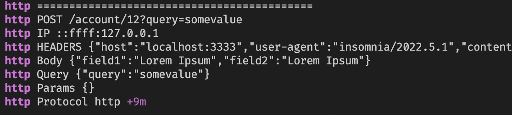

# Request Logger Middleware

Straight forward simple middleware for express server. Logs on terminal every request to the server.

```bash

  http POST /account/12?query=somevalue
  http IP ::ffff:127.0.0.1
  http HEADERS {"host":"localhost:3333","user-agent":"insomnia/2022.5.1","content-type":"application/json","accept":"*/*","content-length":"52"}
  http Body {"field1":"Lorem Ipsum","field2":"Lorem Ipsum"}
  http Query {"query":"somevalue"}
  http Params {}
  http Protocol http +9m
```

# Installation
To install simply run:
`yarn add request-logger-middleware`

# Usage

On your server file:

```javascript
const express = require("express");
const requestLoggerMiddleware = require("request-logger-middleware");
const app = express();
app.use(requestLoggerMiddleware());

```
Package.json:

```json
"scripts": {
    "dev": "DEBUG=http nodemon src/index.js"
  },
```
If you want to disable the logger without touching your code simply remove `DEBUG=http` from your script command. This is specially useful to do when pushing to production since we don't wanna log sensitive information.

Now you should be seeing something like this on your terminal:

